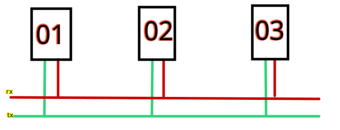

# Requisiti
Agggiungere al gradle del progetto
```gradle
dependencies {
    implementation("com.github.EngMotion:robotic-core:VERSIONE")
}
```
## Scelte di design

### Inizializzazione dh_robotics
Il produttore DH_ROBOTICS non possiede encoder assoluti, quindi ogni volta che si accende il robot, è necessario calibrare la posizione iniziale.
La calibrazione è automatica, ma, per evitare ostacoli e possibili danni, viene eseguita una routine di calibrazione iniziale.

Caso 1: il dispositivo si è spento regolarmente. In questo caso, per design, il robot si trova nella posizione iniziale e la calibratura viene eseguita automaticamente,

Caso 2: pulsante di emergenza o spegnimento forzato. In questo caso, il robot non si trova nella posizione iniziale e la calibrazione non può essere eseguita automaticamente. In questo caso, il robot impiegherà più tempo per calibrarsi eseguendo una routine di ripristino.
- Posizionamento dell'asse B (altezza) il più in alto possibile. In questo modo si evitano danni e si fanno uscire le fialette da eventuali guide.
- Posizionamento dell'asse C (rotazione) in posizione 0.
- Inizializzazione e calibrazione delle pinze. Potrebbe essere necessario un intervento manuale per recuperare e togliere eventuali fiale, tappi o oggetti che potrebbero essere rimaste incastrate nelle pinze.
- Inizializzazione e calibrazione dell'asse A (origine).

### Post inizializzazione
Dopo la calibrazione iniziale, il robot è pronto per l'utilizzo.

## Modalità di utilizzo
### Modalità slave
Modalità di base di utilizzo. Pensata per l'utilizzo del braccio meccanico sul raspberry pi.
TODO

### Modalità configurazione DH Robotics
Questa modalità è pensata per la configurazione dei driver di DH Robotics.

Esempio di come più driver possono trovarsi sulla stessa linea seriale.



La prima volta è necessario configurare i driver in maniera singola in modo da assegnare un indirizzo univoco a ciascun driver.
Gli indirizzi vanno da 1 a 247. Ovviamente è consigliabile andare in ordine crescente, incrementando di 1 ad ogni driver.

Per configurare un driver è necessario:
- Collegare il driver al PC tramite un convertitore USB-RS485
- Avviare il jar in modalità configurazione DH Robotics con il comando
    - `java -jar <programma.jar> dh_robotics_configurator`
- Selezionare la porta seriale a cui è collegato il driver
- Insertire l'indirizzo del driver attuale (di default è 01)
- Inserire l'indirizzo che si vuole assegnare al driver
- Premere il pulsante "Salva e invia"

Se la configurazione è andata a buon fine, il programma restituirà un messaggio di successo.


